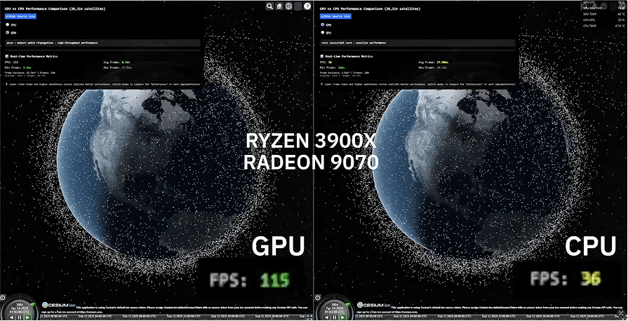

# 3D Satellite Visualization with SGP4GL, Cesium, and Next.js 14

This project demonstrates real-time 3D satellite visualization in the browser using [SGP4GL](https://github.com/Kayhan-Space/sgp4gl), [CesiumJS](https://cesium.com/), and [Next.js 14](https://nextjs.org/). It provides a framework for rendering satellite orbits with web-based ephemeris propagation.

---

## 🚀 Getting Started



### Installation

Clone the repository and install dependencies:

```bash
npm install
```

### Running in Development

```bash
npm run dev
```

### Production Build

```bash
npm run build
npm run start
```

---

## 🌐 Live Demo & Resources

- **Live Demo:** [sgp4gl-demo.vercel.app](https://sgp4gl-demo.vercel.app)
- **sgp4.gl Repository:** [github.com/Kayhan-Space/sgp4gl](https://github.com/Kayhan-Space/sgp4gl)
- **sgp4.gl NPM:** [npm | https://www.npmjs.com/package/sgp4.gl](https://www.npmjs.com/package/sgp4.gl)

---

## ⚙️ Configuration

### Environment Variables

Cesium is configured to use an external tile provider.  
Set the following environment variable in `.env.local`:

```bash
NEXT_PUBLIC_TILES_URL=<your_tile_provider_url>
```

### Cesium File Requirements

Cesium requires specific static assets to be served publicly.  
This is handled with `CopyWebpackPlugin` in `next.config.js`.

> **Note:** Each copy statement must include:
>
> ```js
> info: {
>   minimized: true;
> }
> ```

---

## 🛠️ Compatibility Notes

Integrating Cesium with Next.js can introduce build/runtime challenges.  
This repository is configured to maximize compatibility between:

- **CesiumJS**
- **Next.js 14+**
- **Vercel Deployment**

If you are adapting this project, refer to this repository:

**Barebones Cesium + Next.js Example:** [github.com/hyundotio/next-ts-pagerouter-cesium-example](https://github.com/hyundotio/next-ts-pagerouter-cesium-example)

---

## 📖 License

[MIT](LICENSE) – feel free to use and adapt this project.
